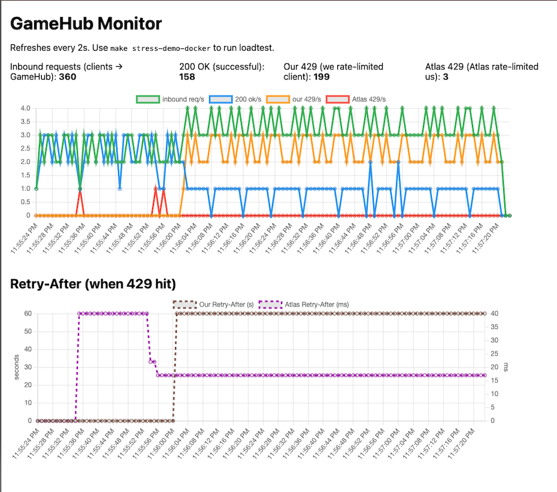

# Stress Test Result

This document describes a representative stress test run and explains how to interpret the monitor dashboard graphs.

## How to Run

```bash
make stress-demo-docker
```

Open http://localhost:8080/monitor before the load test starts. The test runs automatically.

## Test Configuration

| Setting | Value | Description |
|---------|-------|-------------|
| `STRESS_N` | 360 | Total requests to send |
| `STRESS_DELAY` | 250ms | Delay between requests |
| `STRESS_PAGE_SIZE` | 10 | Atlas API page size (triggers more Atlas calls per request) |
| Endpoint | `/players/live` | Path under test |
| Inbound rate limit | 60/min (default) | Max requests per IP per minute |
| Retry-After | 60s | Header we send on our 429 |

The load test sends 360 requests at 250ms intervals, i.e. ~4 requests/second. GameHub allows 60/min ≈ 1 req/s per IP. So we expect most requests to be rate-limited once the token bucket is depleted.

## What Happens During the Test

The client sends **360 requests** to GameHub. Each request can end up in one of three ways:

1. **200 OK** — We accept the request, call Atlas, and return the data. Counted as successful.
2. **Our 429** — We reject the request *before* calling Atlas because the client exceeded our inbound rate limit (60/min). We return 429 with a `Retry-After: 60` header.
3. **Atlas 429** — We accept the request and call Atlas, but Atlas rate-limits us. We forward the 429 (and Atlas’s `Retry-After`) to the client.

The numbers always add up: **Inbound = 200 OK + Our 429 + Atlas 429**.

## Example Results



| Metric | Value | Meaning |
|--------|-------|---------|
| Inbound requests | 360 | Total requests the client sent |
| 200 OK | 158 | Requests we successfully served |
| Our 429 | 199 | Requests we rate-limited (client hit our limit) |
| Atlas 429 | 3 | Requests where Atlas rate-limited us |

## How to Interpret the Graphs

### Top chart: Request rates (req/s)

This chart shows rates per second over time. Each line is a different metric.

| Line | Color | Meaning |
|------|-------|---------|
| inbound req/s | Green | How many requests per second the client is sending |
| 200 ok/s | Blue | How many requests per second we successfully serve |
| our 429/s | Orange | How many requests per second we rate-limit (reject before Atlas) |
| Atlas 429/s | Red | How many requests per second Atlas rate-limits us |

**Initial phase (~11:55:24–11:55:56)**  
- Inbound (green) is 1.5–3 req/s.  
- 200 OK (blue) mostly tracks inbound — we’re under our 60/min limit, so most requests pass through.  
- Our 429 (orange) is near zero.  
- Atlas 429 (red) spikes briefly — we’re passing many requests to Atlas, and Atlas hits its limit a few times.

**Later phase (~11:55:56–11:57:20)**  
- Inbound rises to 3–4 req/s and stays high.  
- Our 429 (orange) jumps to ~3 req/s — our rate limiter engages and rejects excess requests.  
- 200 OK (blue) drops to ~1 req/s — we allow only 60/min ≈ 1/s, the rest get our 429.  
- Atlas 429 (red) drops to zero — by rate-limiting clients, we reduce traffic to Atlas and stop triggering its limit.

### Bottom chart: Retry-After (when 429 hit)

Shows the `Retry-After` header value sent or received when a 429 occurs. Separate chart because these are time values (seconds, ms), not request counts.

| Line | Color | Meaning |
|------|-------|---------|
| Our Retry-After (s) | Brown dashed | Seconds we tell clients to wait when we return 429 |
| Atlas Retry-After (ms) | Purple dashed | Milliseconds Atlas tells us to wait when it returns 429 |

- **Our Retry-After** jumps to 60 when we start returning 429.  
- **Atlas Retry-After** shows values from Atlas when it rate-limits us; it can remain visible for a while after Atlas 429/s goes to 0.

## Conclusion

The test shows that GameHub’s inbound rate limit (60 req/min, 60s Retry-After) behaves as intended. Under ~4 req/s load, we allow ~1 req/s and return 429 for the rest. That protects us from Atlas rate limits: once our limiter engages, Atlas 429s stop.
